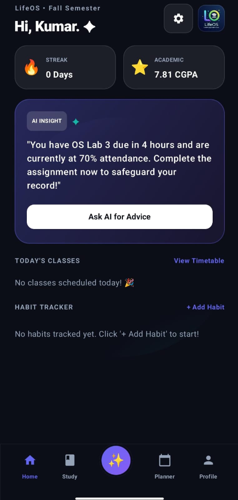
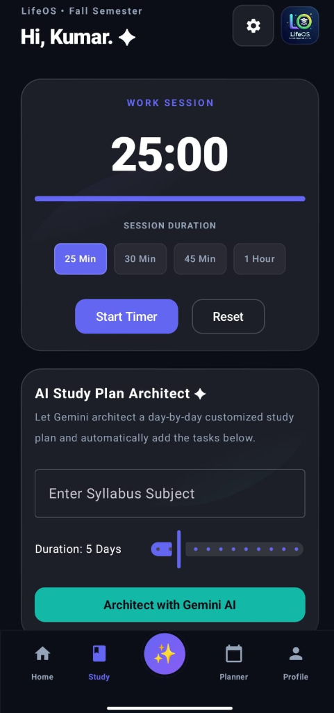
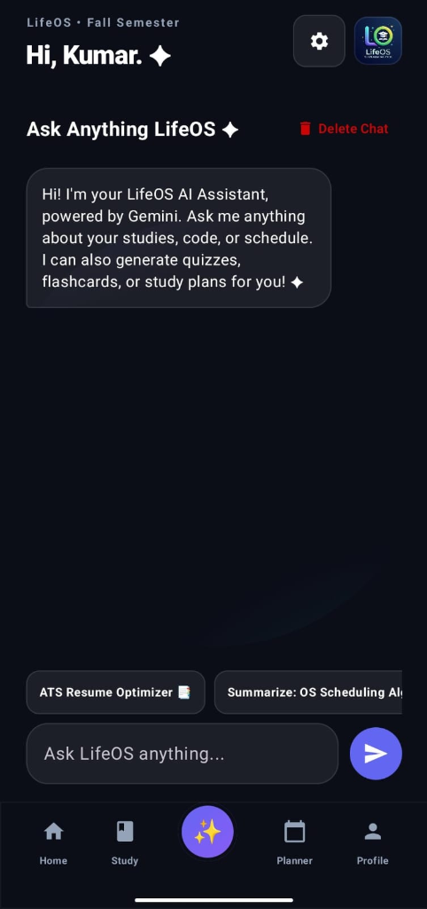
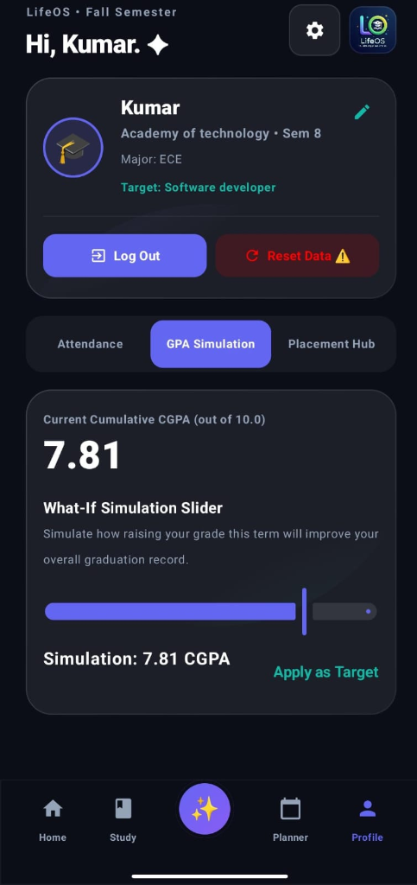
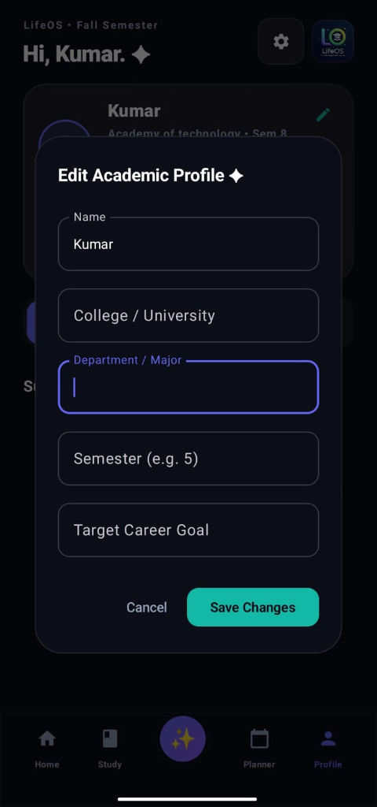

<div align="center">

# ✨ LifeOS
### *AI-Powered Student Operating System for College & University Success*

[](https://developer.android.com)
[](https://kotlinlang.org/)
[](https://developer.android.com/jetpack/compose)
[](LICENSE)

<br/>

**LifeOS** is an all-in-one productivity companion built for college students, LifeOS combines intelligent academic insights, automated study planning, focus work sessions, real-time GPA simulation, habit tracking, and career development tools into a sleek, glassmorphic Android application.

</div>

---

## 🚀 Download Latest Release

 Latest Release 


Version 1.0.1 | Size:- 32 MB | Min SDK: 34 (Android 7.0+)

### 📥 Installation Instructions

1)Download the APK from the link above.

2)Enable "Install from Unknown Sources" in your device settings
3)Open the downloaded APK file.

4)Follow the installation prompts.

5)Launch the app and create your account!

> **Note:** For security reasons, always download from the official GitHub releases page.
---

## 📸 Screenshots & Showcase

<div align="center">

| 🏠 **Home Dashboard & AI Nudges** | ⏱️ **Study Session & AI Architect** |
| :---: | :---: |
|  |  |
| *Real-time streak, academic CGPA, and proactive AI insights for upcoming deadlines & attendance warnings.* | *Pomodoro focus timer (25m-60m) paired with the Gemini AI Study Plan Architect for automated schedule generation.* |

<br/>

| 🤖 **AI Assistant Chat Hub** | 🎓 **GPA Simulator & Placement Hub** | ✏️ **Academic Profile Customization** |
| :---: | :---: | :---: |
|  |  |  |
| *Interactive chat with Gemini for coursework Q&A, ATS resume optimization, and flashcard generation.* | *What-If grade simulator to calculate target CGPA goals alongside attendance metrics.* | *Tailor your profile with department, semester, college/university, and career target settings.* |

</div>

---

## ✨ Key Features

- **💡 Proactive AI Insights**: Get automated context-aware alerts (e.g., pending lab assignments, attendance risk warnings, study recommendations).
- **🤖 Gemini AI Assistant**: Contextually intelligent chatbot capable of generating flashcards, quizzes, ATS resume reviews, and subject summaries.
- **📚 AI Study Plan Architect**: Automatically generates customized, day-by-day study roadmaps from your syllabus topics using Gemini AI.
- **⏱️ Focus Work Session**: Integrated Pomodoro timer with preset session lengths (25m, 30m, 45m, 1 hour) for uninterrupted study blocks.
- **📈 What-If GPA Simulator**: Real-time cumulative CGPA tracking with an interactive grade forecast slider to plan academic targets.
- **📅 Timetable & Habit Tracker**: Easily log daily classes, track habit streaks, and maintain optimal attendance percentages.
- **🎨 Glassmorphic Dark UI**: Modern edge-to-edge interface designed with Google Material 3 design system and dark aesthetic.

---

## 🛠️ Tech Stack & Architecture

- **Language**: [Kotlin](https://kotlinlang.org/)
- **UI Framework**: [Jetpack Compose](https://developer.android.com/jetpack/compose) with Material 3 Design
- **Artificial Intelligence**: [Google Gemini SDK](https://ai.google.dev/) (`com.google.ai.client.generativeai`)
- **Architecture Pattern**: MVVM (Model-View-ViewModel) + StateFlow & Coroutines
- **Build System**: Gradle Kotlin DSL (`build.gradle.kts`)
- **Target SDK**: Android 14+ (API Level 34)

---

## 📥 Getting Started

Follow these steps to set up and run **LifeOS** locally on your machine.

### Prerequisites

- [Android Studio Ladybug (2024.2.1)](https://developer.android.com/studio) or newer
- JDK 17 or higher
- Android SDK (API 34+)
- A [Google Gemini API Key](https://aistudio.google.com/app/apikey)

### Installation Guide

1. **Clone the Repository**
   ```bash
   git clone https://github.com/your-username/LifeOS.git
   cd LifeOS
   ```

2. **Configure Environment Variables**
   Create a file named `.env` in the root project directory (refer to `.env.example`):
   ```env
   GEMINI_API_KEY=your_actual_gemini_api_key_here
   ```

3. **Open Project in Android Studio**
   - Open Android Studio.
   - Select **Open** and choose the `LifeOS` project directory.
   - Allow Gradle to sync dependencies automatically.

4. **Run the Application**
   - Select an Android Virtual Device (Emulator) or connect a physical Android device.
   - Click **Run (`Shift + F10`)** to build and launch **LifeOS**.

---

## 📁 Repository Structure

```text
LifeOS/
├── app/
│   ├── src/
│   │   └── main/
│   │       ├── java/com/example/
│   │       │   ├── data/            # Data models & state handlers
│   │       │   ├── ui/              # Compose screens, viewmodels & themes
│   │       │   └── MainActivity.kt  # Main entry point & Compose initialization
│   │       ├── res/                 # App resources & drawables
│   │       └── AndroidManifest.xml
│   └── build.gradle.kts
├── docs/
│   └── screenshots/                 # Application screenshots & assets
├── .env.example                     # Environment template for Gemini API key
├── build.gradle.kts
├── settings.gradle.kts
└── README.md                        # Project documentation
```

---

## 🤝 Contributing

Contributions, issues, and feature requests are welcome! Feel free to check the [issues page](https://github.com/your-username/LifeOS/issues) if you want to contribute.

1. Fork the Project
2. Create your Feature Branch (`git checkout -b feature/AmazingFeature`)
3. Commit your Changes (`git commit -m 'Add some AmazingFeature'`)
4. Push to the Branch (`git checkout -b feature/AmazingFeature`)
5. Open a Pull Request

---

## 📄 License

Distributed under the MIT License. See `LICENSE` for more information.

<div align="center">
  <sub>Built with ❤️ for students using Kotlin & Google Gemini AI</sub>
</div>
